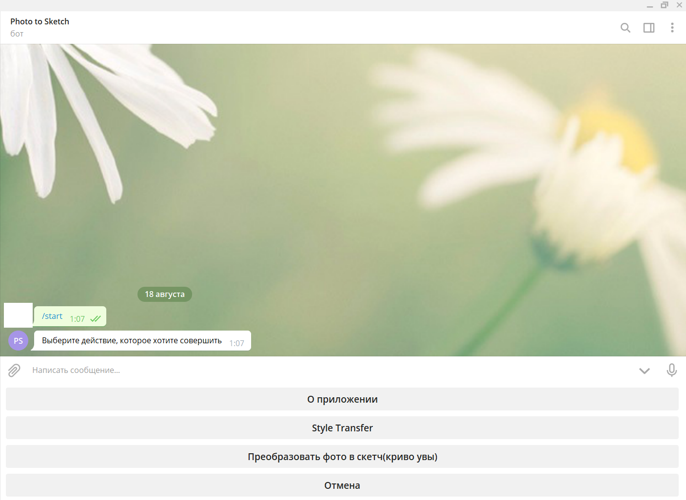
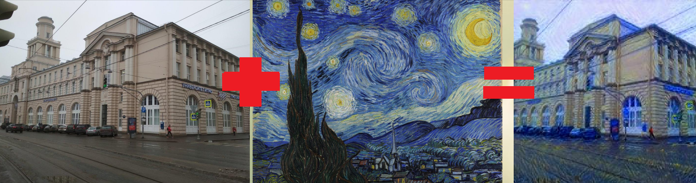
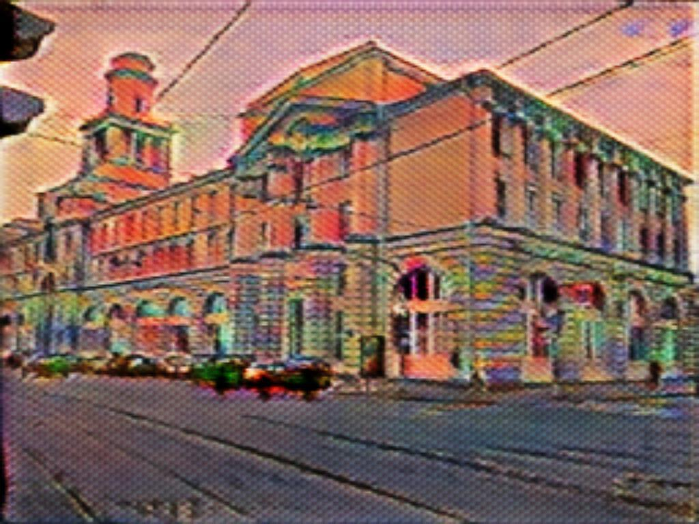

### Телеграм бот для переноса стиля с одного изображения на другое. 

Взаимодействие с API: [Тык](https://github.com/aogavrilov/P2SBot/blob/master/main.py)

Перенос стиля: [Тык](https://github.com/aogavrilov/P2SBot/blob/master/styletr.py)

Ноутбук с styleGAN(photo2sketch): [Тык](https://github.com/aogavrilov/P2SBot/blob/master/model.ipynb)

***Технические аспекты:***

Для API - aiogram, развертка бота на VDS через докер, развертка модели на deepmux. Для переноса стиля используется алгоритм с обучением на картинке с 50 итерациями(ущерб в переносе стиля для уменьшения времени выполнения - 1 мин на CPU). Про преобразование с помощью cycleGAN ниже. 

***Интерфейс***

Все действия пользователь выбирает на предлагаемой ему клавиатуре.

***Пример переноса стиля**

***Немного о cycleGAN в боте***

Пытался сделать трансляцию photo2lofi style, но вышло очень плохо, так как не удалось собрать выборку lofi style достаточного размера(всего 200 картинок вышло).

Пример:

Анализ отрицательного результата: Недостаточный объем данных картинок Lofi style(около 200), недостаточная вычислительная мощность(2 дня на GPU Google Colab Pro)

Ссылка на бота: @photo2sketchbot [Неактивен в данный момент]
